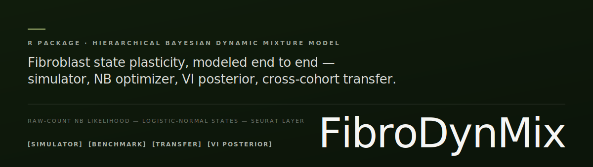

<p align="center">
  
</p>

# FibroDynMix

[](https://doi.org/10.5281/zenodo.20787527)

FibroDynMix is a work-in-progress R package for a hierarchical Bayesian
dynamic mixture model of fibroblast state plasticity.

Public archive:

- GitHub repository: https://github.com/jiangcongxin/FibroDynMix
- Zenodo DOI: https://doi.org/10.5281/zenodo.20787527
- Latest archived creator metadata: `Jiang, Ying`

Package-facing resources:

- Function index: `docs/package-function-index.md`
- Model and simulation specification: `docs/model-and-simulation-spec.md`
- JTM pathological scar translational subproject:
  `projects/jtm_pathological_scar_fibroblast_states/README.md`
- VI posterior and calibration: `docs/vi-posterior.md`
- Independent GSE167339 human validation: `docs/independent-geo-gse167339-validation.md`
- GSE167339 donor robustness: `docs/gse167339-donor-robustness.md`
- Marker stress benchmark: `docs/marker-stress-benchmark.md`
- Bioinformatics validation: `docs/bioinformatics-validation.md`
- Visualization API: `docs/visualization-api.md`
- Engineering quality gates: `docs/engineering-quality-gates.md`
- Package runtime/dependency lock: `docs/package-runtime-lock.md`
- Release notes: `NEWS.md`
- Citation metadata: `inst/CITATION`

The first implemented layer is a simulator for the proposed generative model:

```text
x_ig ~ NegativeBinomial(mu_ig, phi_g)

log(mu_ig) =
    log(library_i)
  + alpha_g
  + sum_k z_ik beta_kg
  + study_effect_sg
  + donor_effect_jg

z_i = softmax(eta_i)
eta_i ~ LogisticNormal(donor_state_mean_j, Sigma_state)
```

The simulator is intended for benchmark scenarios where gene-set scoring
methods should struggle: continuous state mixing, batch confounding, and rare
transition-like cells.

## Example

```r
library(FibroDynMix)

sim <- simulate_fibrodynmix(
  n_studies = 2,
  donors_per_study = 4,
  cells_per_donor = 100,
  n_genes = 1000,
  scenario = "continuous",
  seed = 1
)

dim(sim$counts)
head(sim$cell_metadata)
head(sim$z)
```

## Benchmark Metrics

The package also exposes the first benchmark layer:

```r
state_metrics <- evaluate_state_weights(
  z_true = sim$z,
  z_pred = sim$z
)

marker_truth <- matrix(
  FALSE,
  nrow = length(sim$parameters$state_names),
  ncol = nrow(sim$counts),
  dimnames = list(sim$parameters$state_names, rownames(sim$counts))
)

for (k in seq_along(sim$parameters$marker_index)) {
  marker_truth[k, sim$parameters$marker_index[[k]]] <- TRUE
}

marker_metrics <- evaluate_marker_recovery(
  marker_truth = marker_truth,
  marker_scores = abs(sim$parameters$beta_kg)
)
```

## Visualization

Model and validation outputs can be visualized directly as `ggplot` objects:

```r
composition <- data.frame(
  dataset_id = rep(c("D1", "D2"), each = 2),
  state = rep(c("resident", "inflammatory"), 2),
  composition = c(0.7, 0.3, 0.4, 0.6)
)

plot_state_composition(composition)
```

For Seurat objects annotated by FibroDynMix:

```r
plot_fibroblast_annotation(
  seurat_object,
  reduction = "umap",
  annotation_col = "fibrodynmix_dominant_state"
)

plot_fibroblast_marker_dot(
  seurat_object,
  features = c("COL1A1", "DCN", "ACTA2", "CXCL12", "HLA-DRA")
)
```

## Seurat Integration

FibroDynMix can run as a Seurat workflow layer while keeping the model fit in
the package's raw-count interface:

```r
result <- fit_fibrodynmix_seurat(
  object = seurat_object,
  marker_index = marker_index,
  study_col = "study_id",
  donor_col = "donor_id",
  fit_args = list(n_outer = 2)
)

seurat_object <- result$seurat
head(seurat_object[[]][, c("fibrodynmix_dominant_state", "fibrodynmix_entropy")])
```

## Marker Baseline

The first comparator is a simple marker-score baseline:

```r
benchmark <- run_marker_scoring_benchmark(
  n_studies = 2,
  donors_per_study = 4,
  cells_per_donor = 100,
  n_genes = 1000,
  marker_genes_per_state = 30,
  scenario = "batch_confounding",
  seed = 1
)

benchmark$metrics$rmse
benchmark$metrics$dominant_accuracy
```

This baseline is deliberately separated from the FibroDynMix model. It exists
to quantify how direct marker scoring behaves under mixed states, confounding,
and rare transition scenarios.

A second comparator is a topic/NMF baseline. It uses the mature `NMF` package
when available and falls back to an internal KL-NMF update otherwise:

```r
topic_fit <- fit_topic_nmf_baseline(
  counts = sim$counts,
  marker_index = sim$parameters$marker_index,
  backend = "auto"
)

head(topic_fit$z_pred)
topic_fit$backend
```

## Multi-Scenario Simulation Benchmark

```r
results <- run_simulation_benchmark(
  scenarios = c("continuous", "discrete", "batch_confounding", "rare_transition"),
  n_replicates = 3,
  seed = 1,
  methods = c("marker_scoring", "topic_nmf", "fibrodynmix_initializer", "fibrodynmix_nb", "fibrodynmix_vi"),
  simulation_args = list(
    n_studies = 2,
    donors_per_study = 4,
    cells_per_donor = 100,
    n_genes = 1000,
    marker_genes_per_state = 20
  ),
  initializer_args = list(
    n_iter = 10
  ),
  nb_args = list(
    n_outer = 2,
    initializer_args = list(n_iter = 5)
  ),
  vi_args = list(
    n_draws = 50,
    n_vi_iter = 2
  )
)

summary <- summarize_benchmark_results(results)
summary[, c("scenario", "method", "rmse_mean", "dominant_accuracy_mean")]

optimizer_summary <- summarize_optimizer_diagnostics(results)
optimizer_summary[, c("scenario", "method", "n_nb_runs", "objective_improvement_mean")]

results[results$method == "fibrodynmix_vi", c("vi_interval_coverage", "vi_calibrated_interval_coverage")]
```

## Negative-Binomial Likelihood Layer

The initializer can now be scored under the raw-count NB objective:

```r
fit <- fit_fibrodynmix_initializer(
  counts = sim$counts,
  marker_index = sim$marker_index,
  library_size = sim$cell_metadata$library_size,
  n_iter = 10
)

alpha_nb <- log((rowMeans(sim$counts) + 0.1) / mean(sim$cell_metadata$library_size))
phi <- rep(10, nrow(sim$counts))

nb_objective <- fibrodynmix_nb_objective(
  counts = sim$counts,
  z = fit$z_hat,
  beta = fit$beta_hat,
  alpha = alpha_nb,
  phi = phi,
  library_size = sim$cell_metadata$library_size,
  beta_l2 = 0.01,
  average = TRUE
)
```

The first NB optimizer wraps this objective in alternating updates:

```r
nb_fit <- fit_fibrodynmix_nb(
  counts = sim$counts,
  marker_index = sim$parameters$marker_index,
  library_size = sim$cell_metadata$library_size,
  n_outer = 3,
  initializer_args = list(n_iter = 5),
  marker_l2 = 0.05,
  early_stopping = TRUE,
  rollback_to_best = TRUE
)

nb_fit$nb_objective_trace
nb_fit$stop_reason
```

For batch-confounded simulations or multi-study data, the first hierarchical
extension fits ridge-penalized study-by-gene and donor-by-gene effects:

```r
nb_study_fit <- fit_fibrodynmix_nb(
  counts = sim$counts,
  marker_index = sim$parameters$marker_index,
  library_size = sim$cell_metadata$library_size,
  study_id = sim$cell_metadata$study_id,
  fit_study_effect = TRUE,
  study_l2 = 0.1,
  n_outer = 3
)

dim(nb_study_fit$study_effect)
```

Donor effects can be enabled when donor/sample identifiers are available:

```r
nb_donor_fit <- fit_fibrodynmix_nb(
  counts = sim$counts,
  marker_index = sim$parameters$marker_index,
  library_size = sim$cell_metadata$library_size,
  donor_id = sim$cell_metadata$donor_id,
  fit_donor_effect = TRUE,
  donor_l2 = 0.1,
  n_outer = 3
)

dim(nb_donor_fit$donor_effect)
```

## Real-Data Interface

For real single-cell data, first create a validated FibroDynMix input object.
The package expects raw gene-by-cell UMI counts; normalized expression should
not be passed to the NB optimizer.

```r
prepared <- prepare_fibrodynmix_data(
  counts = counts,
  cell_metadata = cell_metadata,
  marker_index = marker_index,
  cell_id_col = "cell_id",
  study_col = "study_id",
  donor_col = "donor_id",
  min_cells_per_gene = 3,
  min_counts_per_gene = 10
)

fit <- fit_fibrodynmix_prepared(
  prepared,
  n_outer = 3,
  initializer_args = list(n_iter = 5),
  study_l2 = 5,
  marker_l2 = 0.05
)

head(fit$z_hat)
prepared$marker_summary
prepared$filter_summary
```

This interface records cell/gene filtering and retained marker coverage so real
cohort analyses can be audited before figure generation.

The repository also includes smoke-analysis scripts for local and public raw
count inputs:

```bash
Rscript scripts/run_realdata_smoke.R --counts=counts.rds --metadata=metadata.tsv --out=analysis/realdata_smoke

Rscript scripts/run_public_realdata_smoke.R --out=analysis/public_realdata_smoke

Rscript scripts/run_multi_public_realdata_validation.R --out=analysis/multi_public_realdata_validation

Rscript scripts/prepare_gse246215_fibroblast_inputs.R --max-cells-per-group=80

Rscript scripts/run_multi_public_realdata_validation.R \
  --dataset-manifest=data/public_geo_gse246215_fibroblast_atlas/gse246215_fibroblast_dataset_manifest.tsv \
  --out=analysis/independent_geo_gse246215_validation
```

See `docs/public-realdata-smoke.md` for the public dataset source, h5ad export
path, expected outputs, and claim boundary.
See `docs/multi-public-realdata-validation.md` for the registry-driven
multi-public count-matrix validation, pooled fit diagnostics, transition-flow
summary, and leave-dataset-out transfer outputs.
See `docs/independent-geo-gse246215-validation.md` for the independent human
GSE246215 fibroblast atlas validation.

Penalty sensitivity can be benchmarked directly:

```r
study_sensitivity <- run_study_effect_sensitivity(
  study_l2_grid = c(0.05, 0.1, 0.5, 1),
  marker_l2_grid = c(0.05, 0.1),
  n_replicates = 2,
  simulation_args = list(
    n_studies = 2,
    donors_per_study = 3,
    cells_per_donor = 30,
    n_genes = 500,
    marker_genes_per_state = 20
  ),
  nb_args = list(n_outer = 2)
)

study_sensitivity[, c("study_l2", "marker_l2", "rmse", "nb_best_objective")]

selected_penalty <- select_study_effect_penalty(study_sensitivity)
selected_penalty$recommended_study_l2
selected_penalty$recommended_marker_l2
selected_penalty$selection_reason
```

## Cross-Cohort Transfer

The transfer layer freezes a fitted FibroDynMix program and optimizes held-out
cell state weights under the raw-count NB likelihood:

```r
transfer <- fit_fibrodynmix_transfer(
  counts = heldout_counts,
  fit = train_fit,
  library_size = heldout_library_size
)

transfer$nb_objective
head(transfer$z_hat)
```

Leave-study-out transfer can be benchmarked in simulation:

```r
transfer_benchmark <- run_cross_cohort_transfer_benchmark(
  n_replicates = 1,
  simulation_args = list(n_studies = 3)
)

transfer_benchmark[, c("holdout_study", "transfer_rmse", "transfer_dominant_accuracy")]
```

A public real-data transfer smoke test freezes the state program learned in one
public breast fibroblast condition and transfers it to the other:

```bash
Rscript scripts/run_public_realdata_transfer.R --out=analysis/public_realdata_transfer
```

This smoke test checks raw-count transfer mechanics on public data; it is not a
full multi-donor cross-cohort atlas validation.

For a stronger public real-data stress test, run the registry-driven validation:

```bash
Rscript scripts/run_multi_public_realdata_validation.R \
  --max-cells=160 \
  --max-genes=700 \
  --transfer-maxit-z=160
```

This fits a pooled model across multiple public count matrices and performs
leave-dataset-out transfer diagnostics.

An independent human validation can be generated from the GSE246215 public
fibroblast count matrix:

```bash
Rscript scripts/prepare_gse246215_fibroblast_inputs.R --max-cells-per-group=80

Rscript scripts/run_multi_public_realdata_validation.R \
  --dataset-manifest=data/public_geo_gse246215_fibroblast_atlas/gse246215_fibroblast_dataset_manifest.tsv \
  --out=analysis/independent_geo_gse246215_validation \
  --max-cells=80 \
  --max-genes=700 \
  --transfer-maxit-z=160
```

## Bootstrap Uncertainty

The first uncertainty layer uses a lightweight cell bootstrap:

```r
boot <- bootstrap_fibrodynmix(
  counts = sim$counts,
  marker_index = sim$parameters$marker_index,
  library_size = sim$cell_metadata$library_size,
  cell_metadata = sim$cell_metadata,
  sample_col = "donor_id",
  method = "nb_study",
  n_boot = 20,
  fit_args = list(
    n_outer = 2,
    study_l2 = selected_penalty$recommended_study_l2,
    marker_l2 = selected_penalty$recommended_marker_l2
  )
)

head(boot$sample_summary)
head(boot$marker_summary)
```

## Variational Posterior

The package also includes a lightweight logistic-normal VI layer over cell state
logits around the fitted NB mode:

```r
vi <- fit_fibrodynmix_vi(
  counts = counts,
  marker_index = marker_index,
  library_size = library_size,
  nb_args = list(n_outer = 2),
  n_draws = 50
)

vi$elbo_trace
head(vi$cell_summary$z)
```

For a reproducible simulation smoke run:

```bash
Rscript scripts/run_vi_posterior.R
Rscript scripts/run_vi_benchmark.R
Rscript scripts/run_extended_method_benchmark.R
Rscript scripts/run_nb_convergence_benchmark.R
Rscript scripts/run_core_converged_method_benchmark.R
Rscript scripts/run_gse246215_downstream_benchmark.R
Rscript scripts/run_reproducibility_audit.R
```

This is a posterior skeleton for state-weight uncertainty, not yet a full
amortized or fully hierarchical posterior over every model parameter.

`n_outer = 2` examples in this README are fast smoke settings. Use
`scripts/run_nb_convergence_benchmark.R` and a justified convergence or
model-selection rule before treating NB-family results as primary optimizer
evidence.

For the full non-visual research run order and analysis-output map, see
`docs/reproducibility-runbook.md` and
`analysis/reproducibility_audit/analysis_catalog.tsv`.

## Transition Flow and FPI

FibroDynMix can estimate a condition-to-condition state flow from inferred
state composition:

```r
cost <- compute_state_cost(fit$beta_hat)

normal <- colMeans(fit$z_hat[cell_metadata$disease == "normal", ])
disease <- colMeans(fit$z_hat[cell_metadata$disease == "disease", ])

flow <- estimate_transition_flow(
  source = normal,
  target = disease,
  cost = cost,
  lambda = 0.5
)

fpi <- compute_fpi(fit$z_hat, flow = flow$flow)
```
